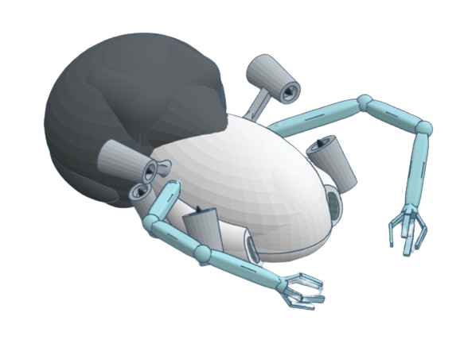

## Aquaguardians: Limpando as Águas, Um Jogo de Cada Vez

**🚀 Uma Solução Inovadora para Combater a Poluição Aquática no Brasil**

**Equipe:**

- Anelize Nardelli
- Cauã Dos Santos Diório
- Felipe Salmazo
- Gustavo Menegassi Lara
- Pedro Gonçalves Bagarini

---

**Orientadores:**

- Cristiano de Paula
- Gustavo Cervati Castello

**🌊 O Problema:**

A poluição hídrica no Brasil é uma ameaça crescente, impactando a saúde dos nossos rios, lagos e oceanos. De acordo com a Fundação SOS Mata Atlântica, apenas 6,5% dos pontos de coleta de água monitorados atingem padrões aceitáveis.

---

**🤖 A Solução:**

Aquaguardians é um projeto inovador que combina tecnologia e entretenimento para combater esse problema. O projeto consiste em um jogo interativo onde jogadores controlam robôs aquáticos movidos a energia sustentável, coletando lixo em áreas contaminadas e contribuindo para a preservação do meio ambiente.

---

**🎮 Jogabilidade:**

- Acesse o jogo através de seu dispositivo móvel, computador ou console.
- Escolha um robô disponível e explore a área de jogo.
- Colete lixo para ganhar pontos e recompensas virtuais.
- Participe de desafios e eventos especiais para aumentar sua pontuação.
- Ganhe dinheiro real convertendo seus pontos.

---

**🤖 Robôs Aquáticos:**

- Os robôs são movidos a energia solar e possuem inteligência artificial para navegar e identificar lixo.
- Eles coletam lixo de forma eficiente e contínua, mesmo quando não há jogadores ativos.
- Os dados coletados pelos robôs são utilizados para monitorar a poluição e otimizar as estratégias de limpeza.

**Protótipo:**

**🌎 Impacto Positivo:**

- **Limpeza das Águas:** Remoção eficiente de resíduos sólidos de rios, lagos e oceanos.
- **Conscientização:** Promover a conscientização sobre a poluição aquática e a importância da sustentabilidade.
- **Renda Extra:** Oferece aos jogadores a possibilidade de ganhar dinheiro através do jogo.
- **Sustentabilidade:** Promove a coleta e a reciclagem de resíduos, incentivando uma economia circular.

---

**💡 Tecnologias:**

- **Gamificação:** Combina a coleta de lixo com um jogo interativo, incentivando a participação e a conscientização.
- **Robótica Sustentável:** Utiliza robôs movidos a energia renovável, reduzindo o impacto ambiental.
- **Inteligência Artificial:** O sistema de coleta automatizada, baseado em IA, garante a eficiência mesmo quando não há jogadores ativos.

---

**💰 Modelo de Negócios:**

- **Clientes:** Jogadores de todas as idades, organizações de preservação ambiental e empresas engajadas em práticas sustentáveis.
- **Canais de Distribuição:** Plataformas digitais, lojas de aplicativos e parcerias com instituições educacionais.
- **Recursos Financeiros:** Investimentos de impacto, crowdfunding, parcerias com empresas e venda de produtos virtuais no jogo.

---

**🚀 Junte-se a nós!**

Aquaguardians é um projeto ambicioso que busca transformar a forma como lidamos com a poluição aquática. Junte-se a nós nessa missão para construir um futuro mais limpo e sustentável para todos!

---

**Links Protótipos/Tecnologias Aquáticos:**

**Link Figma:** [https://www.figma.com/design/yEIXLO3OYhnwsx3XkX4CUK/AquaGuardians?node-id=487-101&t=Vd5U0xFGYfVz6n8F-0](https://www.figma.com/design/yEIXLO3OYhnwsx3XkX4CUK/AquaGuardians?node-id=487-101&t=Vd5U0xFGYfVz6n8F-0)

**Link Trello(Geral):** [https://trello.com/b/RgIeR4gn/not-a-number](https://trello.com/b/RgIeR4gn/not-a-number)

**Link Trello(Unity):** [https://trello.com/b/g9psiyUv/unity-aqg](https://trello.com/b/g9psiyUv/unity-aqg)

---

**💻 Visite nosso site:** [https://www.aquaguardians.com](https://www.aquaguardians.com)

**📱 Baixe o jogo:** [https://play.google.com/store/apps/details?id=com.aquaguardians](https://play.google.com/store/apps/details?id=com.aquaguardians)

**🤝 Entre em contato:** [contato@aquaguardians.com](contato@aquaguardians.com)

---

**#Aquaguardians #Sustentabilidade #PoluiçãoHídrica #GameForChange**
