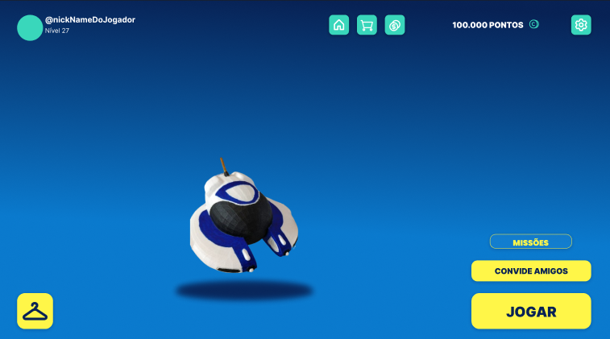

## Aquaguardians: Limpando as Águas

**Uma Solução Inovadora para Combater a Poluição Aquática no Brasil**

**Equipe:**

- [@N4rdelli](https://www.github.com/N4rdelli)
- [@di0rio](https://www.github.com/di0rio) 
- [@SmzFz](https://www.github.com/SmzFz) 
- [@gustavo-lara](https://www.github.com/gustavo-lara)
- [@B4g4rini](https://www.github.com/B4g4rini)

---

**Orientadores:**

- [@Prof-Castello](https://www.github.com/Prof-Castello) 
- [@ProfCristianoDePaula](https://www.github.com/ProfCristianoDePaula) 

**🌊 O Problema:**

A poluição hídrica no Brasil é uma ameaça crescente, impactando a saúde dos nossos rios, lagos e oceanos. De acordo com a Fundação SOS Mata Atlântica, apenas 6,5% dos pontos de coleta de água monitorados atingem padrões aceitáveis.

---

**🤖 A Solução:**

Aquaguardians é um projeto inovador que combina tecnologia e entretenimento para combater esse problema. O projeto consiste em um jogo interativo onde jogadores controlam robôs aquáticos movidos a energia sustentável, coletando lixo em áreas contaminadas e contribuindo para a preservação do meio ambiente.

---

**🤖 Robôs Aquáticos:**

- Os robôs são movidos a energia solar e possuem inteligência artificial para navegar e identificar lixo.
- Coletam lixo de forma eficiente e contínua, mesmo quando não há jogadores ativos.
- Os dados coletados pelos robôs são utilizados para monitorar a poluição e otimizar as estratégias de limpeza.

**Protótipo:**

**🌎 Impacto Positivo:**

- **Limpeza das Águas:** Remoção eficiente de resíduos sólidos de rios, lagos e oceanos.
- **Conscientização:** Promover a conscientização sobre a poluição aquática e a importância da sustentabilidade.
- **Renda Extra:** Oferece aos jogadores a possibilidade de ganhar dinheiro através do jogo.
- **Sustentabilidade:** Promove a coleta e a reciclagem de resíduos, incentivando uma economia circular.

---

**💡 Tecnologias:**

- **Unity**
- **VS Code** 
- **Visual Studio 2022**
- **SQL Server**
- **Trello**
- **Figma**

**Protótipo do Game:**

---

**👾 Links Protótipos/Tecnologias:**

**🔗 Link Figma:** [https://www.figma.com/design/yEIXLO3OYhnwsx3XkX4CUK/AquaGuardians?node-id=487-101&t=Vd5U0xFGYfVz6n8F-0](https://www.figma.com/design/yEIXLO3OYhnwsx3XkX4CUK/AquaGuardians?node-id=487-101&t=Vd5U0xFGYfVz6n8F-0)

**🔗 Link GDD:** [https://www.canva.com/design/DAGMnBxaEq8/Z2De5KjgWYD13JH4JuNagQ/edit?utm_content=DAGMnBxaEq8&utm_campaign=designshare&utm_medium=link2&utm_source=sharebutton](https://www.canva.com/design/DAGMnBxaEq8/Z2De5KjgWYD13JH4JuNagQ/edit?utm_content=DAGMnBxaEq8&utm_campaign=designshare&utm_medium=link2&utm_source=sharebutton)

**🔗 Link Trello(Geral):** [https://trello.com/b/RgIeR4gn/not-a-number](https://trello.com/b/RgIeR4gn/not-a-number)

**🔗 Link Trello(Unity):** [https://trello.com/b/g9psiyUv/unity-aqg](https://trello.com/b/g9psiyUv/unity-aqg)

---

**💻 Visite nosso site:** [https://www.aquaguardians.com](https://www.aquaguardians.com)

**📱 Baixe o jogo:** [https://play.google.com/store/apps/details?id=com.aquaguardians](https://play.google.com/store/apps/details?id=com.aquaguardians)

**🤝 Entre em contato:** [contato@aquaguardians.com](contato@aquaguardians.com)

---

**#Aquaguardians #Sustentabilidade #PoluiçãoHídrica #GameForChange**
